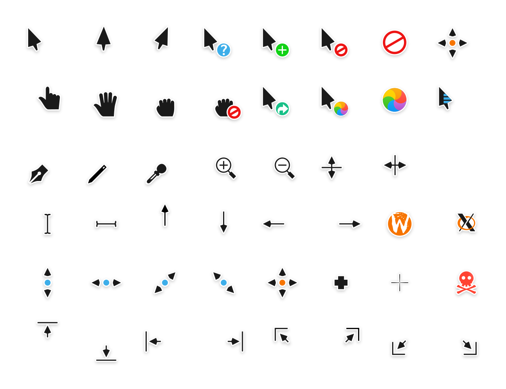

# Osmium cursors
This is an x-cursor theme inspired by macOS and based on KDE Breeze.
The source files were made in Inkscape, and the theme was designed to
pair well with my icon pack,
[Osmium](https://github.com/o2system/Osmium-cursors).

## Pre-built binaries
### GNU/Linux
Everything you need to build the xcursor theme is found in `src/`, and
the prebuilt theme for GNU/Linux desktops is found in `dist/`.

### Windows
I have also provided a Windows cursor theme available in `.windows/`,
though it is not buildable from source due to the broken nature of
Microsoft's operating system. Microsoft cursors must be made using a
proprietary GUI editor from PNG sources, which is **bad**. For this
reason, the Windows version of Osmium cursors will not receive
substantial updates.

## Notes
Building the x-cursor theme from SVG source requires a regular inkscape
installation. It also needs a command called `xcursorgen`. If the build
script fails, you should probably install inkscape and xcursorgen using
your preferred package manager :)

## License
Osmium cursors is based on KDE Breeze cursors, as such it falls under
the same license.

Osmium cursors is LGPLv3. See COPYING for more details.

## Installation
### \*NIXes, \*BSDs, and possibly others
To install the cursor theme simply copy the compiled theme to your icons
directory. For local user installation:

```
cp -pr dist/ ~/.icons/Osmium-cursors
```

For system-wide installation for all users:

```
sudo cp -pr dist/ /usr/share/icons/Osmium-cursors
```

Then set the theme with your preferred desktop tools.


### Windows
The Windows build comes with an INF file to make installation easy.
 1. Open `.windows/` in Explorer, and right click on `install.inf`.
 2. Click 'Install' from the context menu, and authorise the
    modifications to your system.
 3. Open `Control Panel` > `Personalisation and Appearance` >
    `Change mouse pointers`, and select Osmium cursors.
 4. Click 'Apply'.

## Building from source
You'll find everything you need to build and modify this cursor set in
the `src/` directory. To build the xcursor theme from the SVG source
run:

```
./build.sh
```

This will generate the pixmaps and appropriate aliases.
The freshly compiled cursor theme will be located in `dist/`

## Preview

